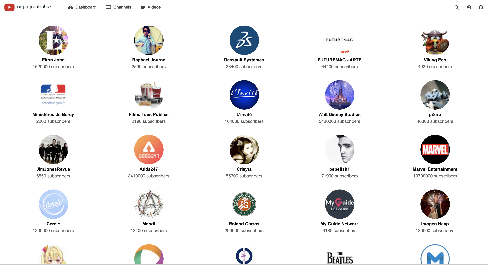

# Ng-YouTube

> Youtube player app built with Angular 8 and NGRX that allows to search and view channels and start youtube videos on a video player using the [`YouTube v3 API`](https://developers.google.com/youtube/v3/).

## Demo

A live [demo](https://bnsalahfahmi.github.io/ng-youtube) of ng-youtube is hosted on Github Pages.



## Prerequisite
* Nodejs v10+
* yarnpkg (optional)

## Before you start

 1. You need a [Google Account](https://www.google.com/accounts/NewAccount) to access the Google APIs Console, request an API key, and register your application.
 2. [Register your application](https://console.developers.google.com/project) with Google so that it can submit API requests:
 3. After registering your application, select **YouTube Data API** as one of the services that your application uses.

     - Go to the [APIs Console](https://console.developers.google.com/project) and select the project that you just registered.
     - Click on *APIs & auth* on the left side. Then a dropdown will be opened.
     - Select *APIs*.
     - Search for *YouTube Data API v3*, click it and click <kbd>Enable API</kbd>


## Installation and usage

**1- Install [Angular-CLI](https://github.com/angular/angular-cli) :**

```bash
$ npm install -g @angular/cli@latest
```

**2- Clone the project:**

```bash
$ git clone https://github.com/BnSalahFahmi/ng-youtube.git
$ cd ng-youtube
```

**3- Install the npm packages described in the package.json :**

```bash
$ npm install
```

**4- Go back in your Google app and click again on *APIs & auth*, select *Credentials* and then click <kbd>Create new Client ID</kbd>:**

     - Select *Web application*
     - Click <kbd>Configure consent screen</kbd>
     - Complete the required fields:

         - Product name: what ever you want (e.g. "Youtube API Test")
         - Product logo is optional
         - Home page is optional
         - Save the changes

     - Now you will have to set the auth urls. This test application uses the following urls:

         - Authorized JavaScript origins: `http://localhost:4200/` (paste it in the first textarea)
         - Authorized redirect URIs: `http://localhost:4200/oauth2callback` (paste it in the second textarea)

     - Finally, click <kbd>Create Client ID</kbd>


OK, at this step you have the credentials (in your Google app). Now you have to use them in this test application:

 1. Go to environments folde and open `environment.ts` and replace `YOUTUBE_API_KEY` with the **key** generated previously.
 2. Now you are ready. Start the script (`npm start` or `ng serve`), visit `http://localhost:4200` and enjoy!.

 
## Dependencies
- Angular 8
- Angular CLI
- NGRX
- Angular Material
- Bootstrap 4
- ngx-infinite-scroll
- ng-mat-search-bar
- lodash
- angular-font-awesome

## Contributors  

**@author:** 'Fahmi BEN SALAH *< [fahmii.bensalah@gmail.com](mailto:fahmii.bensalah@gmail.com) >*' 

### Contributing
If you like the project, shoot a :star2: and feel free to fork & send PR anytime.
